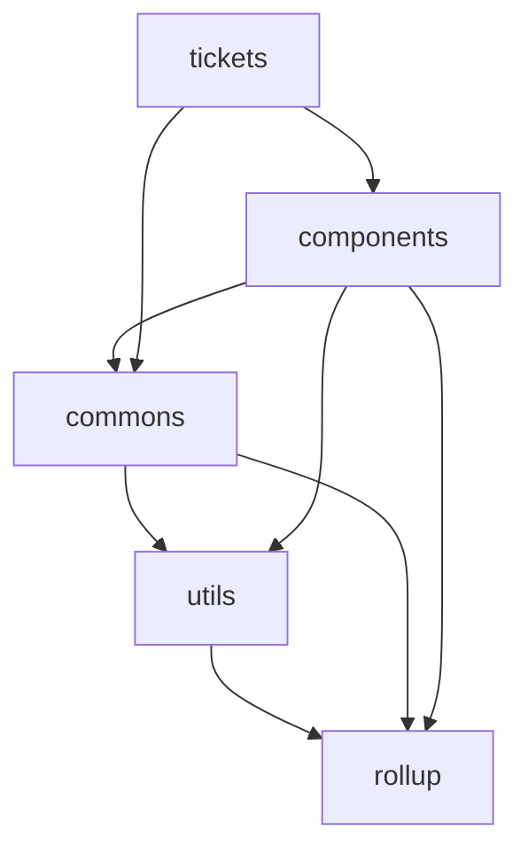

A starter kit for building modern JavaScript projects.

# Features

### Monorepo

Monorepo is awesome. If you want to know more, please visit this [awesome repo](https://github.com/korfuri/awesome-monorepo). In this starter, we have below projects:

```
├── commons
├── components
├── rollup
├── tickets
└── utils
```

the dependency of the projects looks like below:



### Lerna

The project is managed by [lerna](https://lerna.js.org) and [yarn workspaces](https://yarnpkg.com/lang/en/docs/workspaces/).

### TypeScript

[TypeScript](https://www.typescriptlang.org/) is a strong tool for building large apps. It's now the de-facto dialect for JavaScript.

### React

Acutally, this starter is not a repository only for React, it just uses React as an example. You can of cause use any framework as you like, [lerna](https://lerna.js.org) can handle your projects elegantly.

If you use [create-react-app](https://github.com/facebook/create-react-app) to create your app, you need update your scripts section in package.json like below:

```json
"scripts": {
  "clean": "rimraf build",
  "test": "CI=true react-scripts test",
  "watch": "yarn start"
}
```

`clean` task is to delete the build directory, `CI=true` in test means we don't need watch the running of tests, it is especially useful when running on CI server.

And also, you need either remove eslintConfig section in `package.json` or just leave it empty as we are using global eslint config to lint the sources.

```json
"eslintConfig": {
  "extends": "react-app" // remove this line
}
```

### ESLint

We lint and format the source code by [ESLint](https://eslint.org/). You can run: `yarn lint:code` to lint the files for `js`, `jsx`, `ts` and `tsx`, and you can run `yarn fix:code` to fix/format the code.

### Prettier

We lint and format the other files like `md`, `css`, `scss`, `yaml` by [Prettier](https://prettier.io/). You can run: `yarn lint:other` to check the files and run `yarn fix:other` to prettify those files.

### CommitLint

We use [husky](https://github.com/typicode/husky) and [commitlint](https://github.com/conventional-changelog/commitlint) to lint commit messages. The commit message should be structured as follow:

```
<type>[optional scope]: <description>

[optional body]

[optional footer(s)]
```

To help you write the commit message, [commitizen](http://commitizen.github.io/cz-cli/) is used. If you want to use `git commit`, you need install [commitizen](http://commitizen.github.io/cz-cli/) globally or you can just run `yarn commit` in local directory.

We also generate [conventional changelog](https://github.com/conventional-changelog/conventional-changelog) from those [conventional commits](https://www.conventionalcommits.org/en/v1.0.0/) by running script:

```
yarn changelog
```

### Rollup

[Rollup](https://rollupjs.org) is a module bundler. We use [rollup](https://rollupjs.org) to compile TypeScript and bundle the libraries.

A general project `@starter/rollup` is already there for 85% cases. Just add it to your `devDependencies` and create `rollup.config.js` in your project as simple as follow:

```javascript
import { config } from "@starter/rollup";

export default config({
  input: `./src/index.ts`
});
```

add your build scripts to `package.json`:

```json
"scripts": {
  "build": "run-s clean build:prod",
  "build:dev": "cross-env NODE_ENV=development rollup -cw",
  "build:prod": "cross-env NODE_ENV=production rollup -c"
}
```

# Useful Commands

Everytime, you start from the scratch, run below command:

```
yarn bootstrap
```

it will install all dependencies of the projects. Then, you can run:

```
yarn bundle
```

it will bundle all projects in the repo.

For daily development, just run:

```
yarn watch
```

it will run projects in development mode.

More commands can be found in [package.json](./package.json).

# TODO

### Tests

Tests is the one of the most important part in software development. So far, I haven't add the test framework in this starter yet. But you can add any test framework to your projects and then add `test` script to `package.json` in your project. Running `yarn test` will call your script (thanks to the awesome `lerna`).

- [ ] jest
- [ ] cypress

# References

To build this starter, I have referenced lots of projects, and of cause, I have stolen lots of the ideas and codes from them, below are some I think especially useful:

- [Gatsby](https://github.com/gatsbyjs/gatsby)
- [Docz](https://github.com/doczjs/docz)
- [TypeScript](https://github.com/microsoft/TypeScript)
- [Lerna](https://github.com/lerna/lerna)
- [Docusaurus](https://github.com/facebook/docusaurus)
- [Create React App](https://github.com/facebook/create-react-app)
